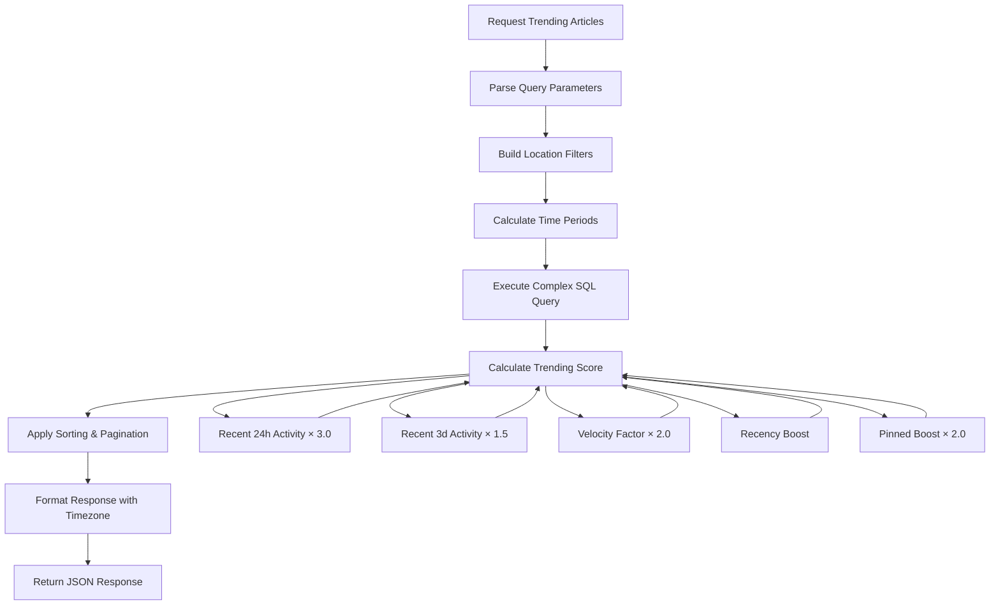
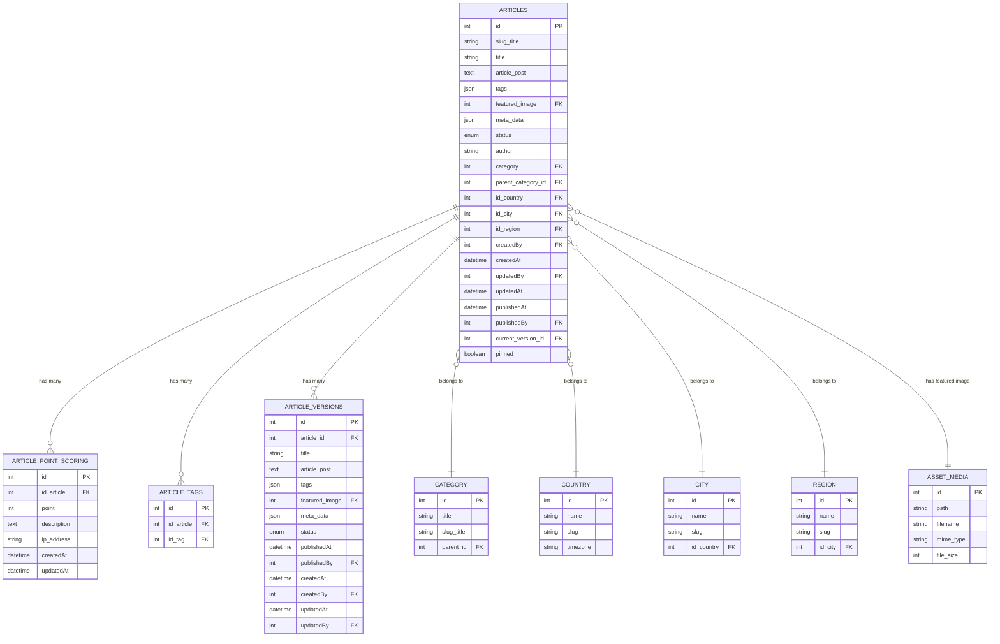
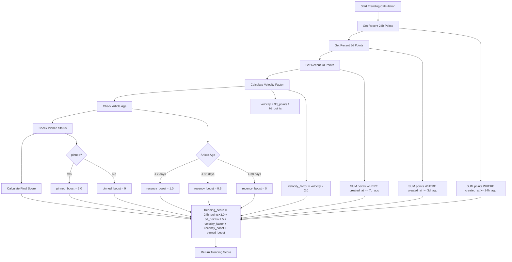
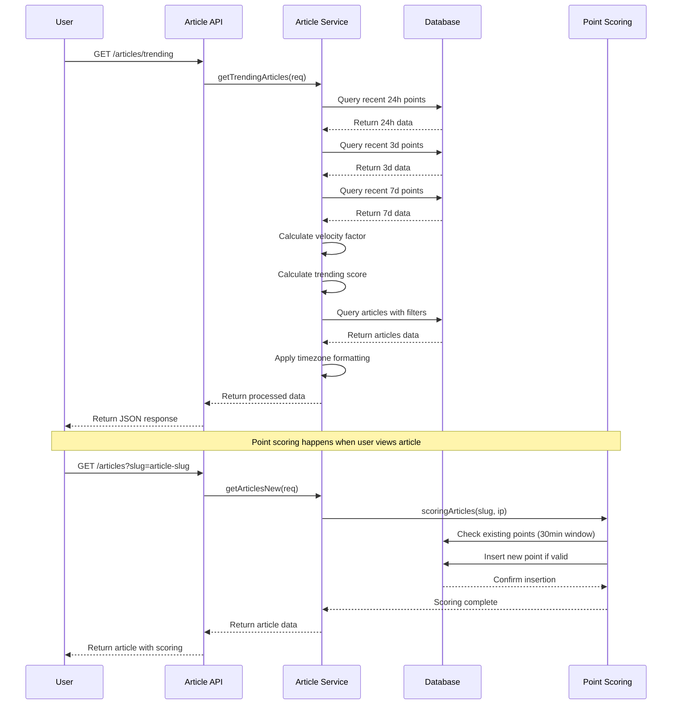
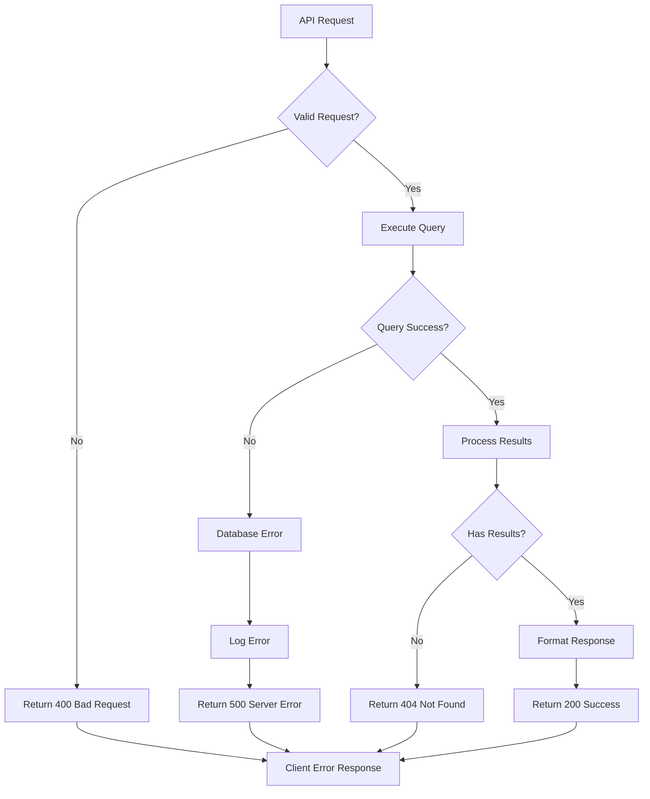
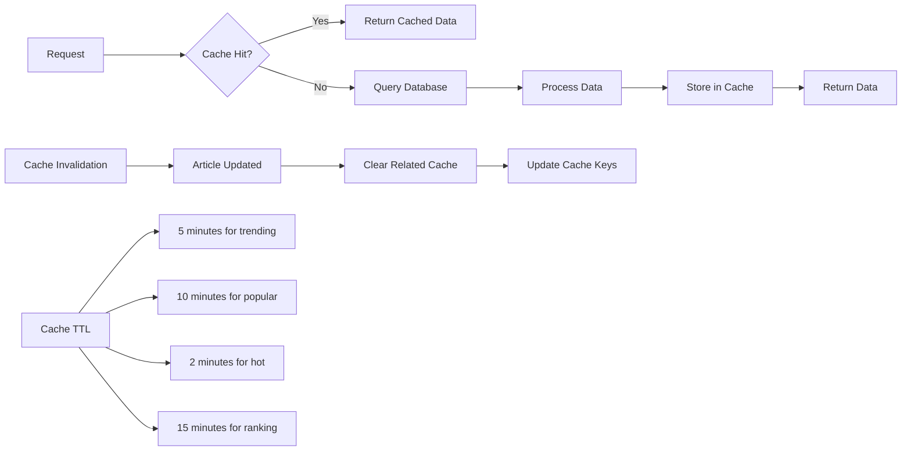

# Diagram Algoritma Trending Articles

## 1. Flow Diagram Sistem Trending



## 2. Database Schema Relationship



## 3. Trending Score Calculation Flow



## 4. API Endpoint Architecture

```mermaid
graph LR
    A[Client Request] --> B[Express Router]
    B --> C[Article Controller]
    C --> D[Article Service]
    D --> E[Database Query]
    E --> F[Response Processing]
    F --> G[JSON Response]
    
    B --> B1[/trending]
    B --> B2[/popular]
    B --> B3[/hot]
    B --> B4[/ranking]
    
    C --> C1[getTrendingArticles]
    C --> C2[getPopularArticles]
    C --> C3[getHotArticles]
    C --> C4[getArticleRanking]
    
    D --> D1[Complex SQL Query]
    D --> D2[Score Calculation]
    D --> D3[Timezone Processing]
    
    E --> E1[MySQL Database]
    E --> E2[Articles Table]
    E --> E3[Article Point Scoring Table]
```

## 5. Performance Optimization Strategy

```mermaid
graph TD
    A[Performance Optimization] --> B[Database Level]
    A --> C[Application Level]
    A --> D[Infrastructure Level]
    
    B --> B1[Index Optimization]
    B --> B2[Query Optimization]
    B --> B3[Connection Pooling]
    
    B1 --> B1a[Index on created_at]
    B1 --> B1b[Index on id_article]
    B1 --> B1c[Composite Indexes]
    
    B2 --> B2a[LEFT JOIN Optimization]
    B2 --> B2b[Subquery Optimization]
    B2 --> B2c[LIMIT/OFFSET Optimization]
    
    C --> C1[Caching Strategy]
    C --> C2[Response Optimization]
    C --> C3[Error Handling]
    
    C1 --> C1a[Redis Cache]
    C1 --> C1b[Memory Cache]
    C1 --> C1c[Cache Invalidation]
    
    C2 --> C2a[Pagination]
    C2 --> C2b[Field Selection]
    C2 --> C2c[Compression]
    
    D --> D1[Load Balancing]
    D --> D2[CDN Integration]
    D --> D3[Monitoring]
    
    D1 --> D1a[Multiple Instances]
    D1 --> D1b[Health Checks]
    
    D3 --> D3a[Response Time Monitoring]
    D3 --> D3b[Error Rate Tracking]
    D3 --> D3c[Database Performance]
```



## 6. Data Flow untuk Scoring System



## 7. Error Handling Flow



## 8. Caching Strategy


